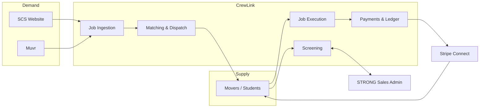

# CrewLink — Labor-Only Moving Workforce Platform

> **Elevator pitch:** CrewLink is a nationwide, labor-only moving workforce network. We recruit, screen and schedule students and gig workers ("Movers"), then fulfil moving jobs sourced from partner demand channels (SCS, Muvr). Every completed job settles automatically: **30% platform fee / 70% to the crew that did the work.**

We are **not** a consumer marketplace like HireAHelper, and **not** a vertically integrated ops company like Caddy Moving. We are the **labor supply layer** those companies need — a screened, scheduled, on-demand crew network exposed to demand partners through an API.

---

## Document index

| # | Document | What it covers |
|---|---|---|
| 01 | [Business Strategy](docs/01-business-strategy.md) | Market, competitor teardown, positioning, unit economics, GTM, risks |
| 02 | [Product Requirements](docs/02-product-requirements.md) | Personas, epics, user stories, acceptance criteria, MVP scope |
| 03 | [System Architecture](docs/03-system-architecture.md) | C4 diagrams, services, tech stack, infra, security, scaling |
| 04 | [Data Model](docs/04-data-model.md) | ERD, tables, indexes, state machines |
| 05 | [API Specification](docs/05-api-specification.md) | REST endpoints, payloads, webhooks, errors |
| 06 | [Integrations](docs/06-integrations.md) | STRONG screening, SCS, Muvr, Checkr, Stripe, Twilio, Maps |
| 07 | [Payments & Payouts](docs/07-payments-and-payouts.md) | 70/30 ledger, Stripe Connect, refunds, 1099 |
| 08 | [Compliance & Legal](docs/08-compliance-legal.md) | Worker classification, AB5, insurance, tax, TOS |
| 09 | [Matching & Dispatch](docs/09-matching-dispatch.md) | Geo/schedule matching, scoring, tiered broadcast, escalation |
| 10 | [Implementation Roadmap](docs/10-implementation-roadmap.md) | Phases, sprints, team, budget |

---

## Working assumptions

These four decisions were unresolved at authoring time. Each is flagged inline in the docs as `ASSUMPTION`. Changing any of them has architectural consequences, noted in each document.

| # | Assumption | Impact if changed |
|---|---|---|
| A1 | **Platform-collects-then-splits.** SCS/Muvr pay CrewLink the full job value; CrewLink retains 30% and pays crew 70%. | If partners pay movers directly, Stripe Connect topology flips from `destination charge` to `invoiced platform fee`; see [07](docs/07-payments-and-payouts.md). |
| A2 | **Movers are 1099 independent contractors.** | W2 conversion adds payroll provider (Gusto/Check), workers' comp per state, and time-clock compliance; see [08](docs/08-compliance-legal.md). |
| A3 | **STRONG exposes REST + webhooks**, with CSV import as fallback. | Adapter pattern isolates this; only `ScreeningProvider` implementation changes. See [06](docs/06-integrations.md). |
| A4 | **PWA-first mover app**, native Expo app in Phase 3. | Background GPS and push reliability are degraded on PWA; see [03](docs/03-system-architecture.md). |

---

## Quick architecture snapshot

---

## Status

Planning artefacts only. No application code has been written yet. Start with [10 — Implementation Roadmap](docs/10-implementation-roadmap.md) for the build sequence.
# newTest
