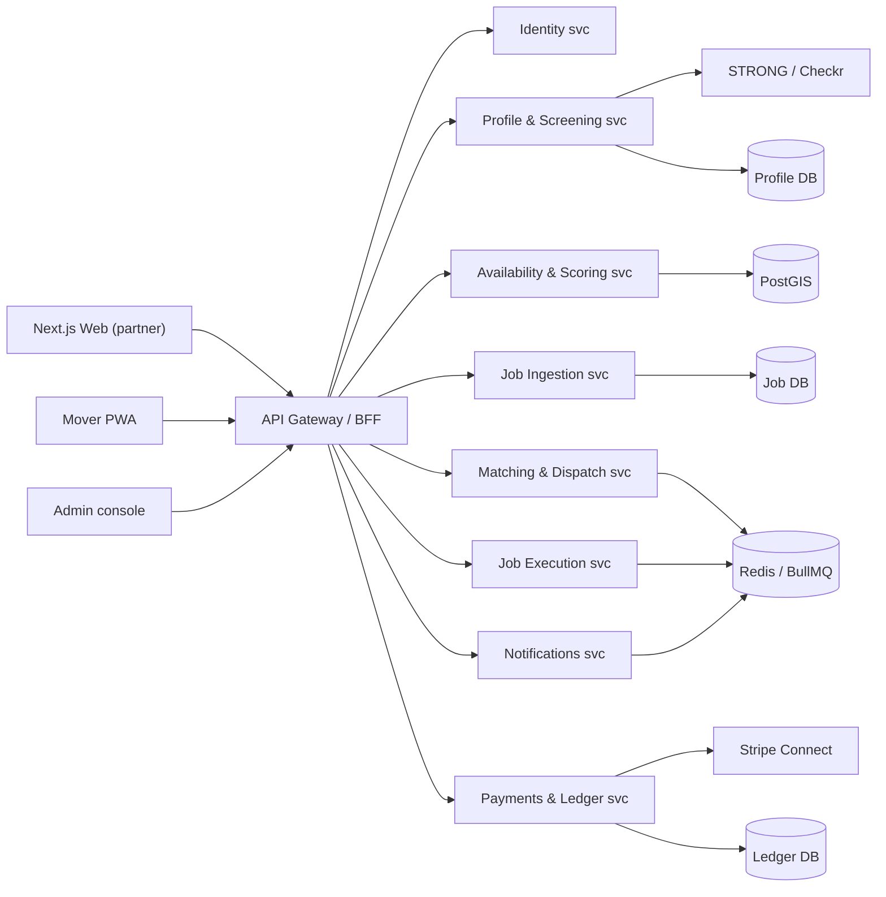

# 03 — System Architecture

## 1. Architectural tenets
1. **Money is the ledger.** The ledger is single-writer, immutable, and stores integer cents (USC). Everything else is eventually consistent.
2. **Partner-agnostic ingestion.** SCS, Muvr and future partners are interchangeable adapters around one canonical `Job` model. No partner-specific code lives above the ingestion layer.
3. **Screening is an external system of record.** STRONG gates activation but never blocks the server; a local mirror keeps operations live when STRONG is unreachable.
4. **Availability is truth, presence is the accelerator.** Availability grids drive all broadcasts; online presence only tightens same-day windows.
5. **Stateless API, stateful queues.** Web/API scale horizontally; dispatch, payments and notifications are decoupled via queues.

## 2. Context diagram (C4 Level 1)

```mermaid
flowchart LR
    M["Customer / Move Owner"] ---|"job & status"| C["CrewLink Core"]
    P["SCS Website"] --->|"POST /jobs, webhooks, invoices"| C
    MU["Music"] --->|"same partner API"| C
    S["STRONG Sales Admin"] <-->|"screening verdict webhooks"| C
    CK["Checkr"] <-->|"background check API"| C
    TW["Twilio"] <--|"SMS / push"| C
    MP["Map APIs"] <--|"geocode + ETA"| C
    ST["Stripe Connect"] <-->|"capture + payouts"| C
    C <-->|"Mover app"| A["Movers"]
    C -->|"ops UI"| O["Admin / Ops / Finance"]
```

## 3. Service decomposition (C4 Level 2)


