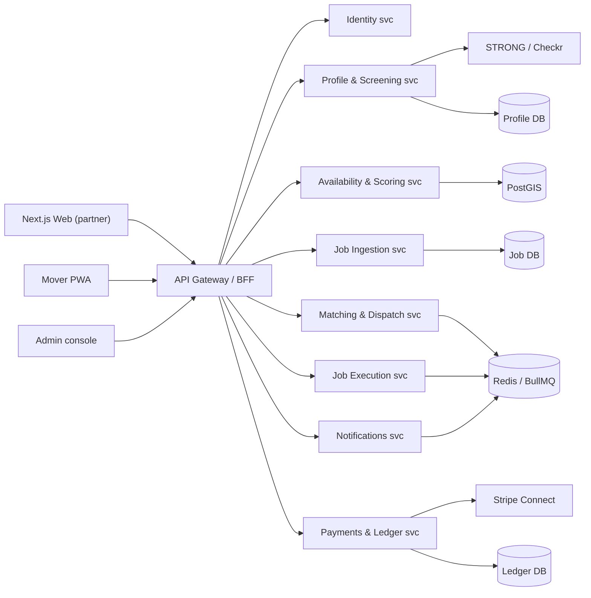

# 03 — System Architecture

## 1. Architectural tenets
1. **Money is the ledger.** The ledger is single-writer, immutable, and stores integer cents (USC). Everything else is eventually consistent.
2. **Partner-agnostic ingestion.** SCS, Muvr and future partners are interchangeable adapters around one canonical `Job` model. No partner-specific code lives above the ingestion layer.
3. **Screening is an external system of record.** STRONG gates activation but never blocks the server; a local mirror keeps operations live when STRONG is unreachable.
4. **Availability is truth, presence is the accelerator.** Availability grids drive all broadcasts; online presence only tightens same-day windows.
5. **Stateless API, stateful queues.** Web/API scale horizontally; dispatch, payments and notifications are decoupled via queues.

## 2. Context diagram (C4 Level 1)

```mermaid
flowchart LR
    M["Customer / Move Owner"] ---|"job & status"| C["CrewLink Core"]
    P["SCS Website"] --->|"POST /jobs, webhooks, invoices"| C
    MU["Muvr"] --->|"same partner API"| C
    S["STRONG Sales Admin"] <-->|"screening verdict webhooks"| C
    CK["Checkr"] <-->|"background check API"| C
    TW["Twilio"] <--|"SMS / push"| C
    MP["Map APIs"] <--|"geocode + ETA"| C
    ST["Stripe Connect"] <-->|"capture + payouts"| C
    C <-->|"Mover app"| A["Movers"]
    C -->|"ops UI"| O["Admin / Ops / Finance"]
```

## 3. Service decomposition (C4 Level 2)



## 4. Service responsibilities

| Service | Owns | Key external calls |
|---|---|---|
| **Identity** | authN/Z, sessions, roles, device tokens | Clerk / Auth0 |
| **Profile & Screening** | mover status machine, STRONG + Checkr adapters, screening mirror, W-9 | STRONG, Checkr, S3 |
| **Availability & Scoring** | weekly grid, reliability & rating score, PostGIS index | PostGIS queries |
| **Job Ingestion** | partner webhooks/poll, normalize to canonical Job, dedupe | SCS / Muvr adapters |
| **Matching & Dispatch** | candidate selection, tiering, TTL negotiation, standby | BullMQ, PostGIS |
| **Job Execution** | assignment lifecycle, reminders, geofenced check-in/out, timeline, incidents | Map APIs, Twilio |
| **Payments & Ledger** | capture, 70/30 split, payout orchestration, W-9 gate | Stripe Connect, Ledger DB |
| **Notifications** | SMS / push / email templates, delivery receipts | Twilio, push providers |

## 5. Technology stack

### Client
- **Web (partner & consumer later):** Next.js 14 (App Router, TypeScript, Tailwind), hosted on Vercel.
- **Mover app:** mobile-responsive **PWA** for MVP; migrate to **Expo React Native** in Phase 3 for background GPS + reliable push.
- **Admin console:** Next.js in the same repo, role-based routes.
- **STRONG dashboard:** external, used as-is. Integration via API/webhooks (assumption A3).

### Server
- **Runtime:** Node.js 20 LTS + **NestJS**. MVP ships as one deployable with strict module boundaries (the services above); split into services at scale.
- **Auth:** Clerk or Auth0 (JWT, RBAC). Mover push tokens stored per device.
- **Queues:** Redis + BullMQ for dispatch, reminders, payouts, webhook delivery, retries.
- **Scheduler:** BullMQ repeatable jobs for ingest polls and daily optical recaps.

### Data
- **PostgreSQL 15 + PostGIS:** jobs, movers, availability, ledger, audit. Timezone-aware timestamps stored in UTC.
- **Redis:** queues, mover presence, rate limits, idempotency keys, broadcast cache.

### Deployment options
| Option | Pros | Cons | Choice |
|---|---|---|---|
| A. Render/Railway + Neon + Upstash Redis | fast, cheap, low ops | fewer control-plane features | **MVP** |
| B. AWS ECS Fargate + RDS + ElastiCache | full control, compliance | ops cost + expertise | **Phase C+** |

## 6. Key operational paths

### A. Mover onboarding to ACTIVE
```
Signup (PWA)
  -> Identity + KBA
  -> STRONG screen (assessments + ID) -> verdict webhook
  -> Checkr candidate + background -> completion webhook
  -> W-9 e-sign + contractor agreement
-> all three green -> status ACTIVE (deduplicated by webhook idempotency)
Screening verdicts mirrored nightly into local DB for ops visibility.
```

### B. Job lifecycle
```
RECEIVED -> VALIDATED -> MATCHING -> ASSIGNED -> STARTED -> COMPLETE -> SETTLED
                            |-> NO_COVERAGE -> CANCELLED
              ASSIGNED -> NO_SHOW / MISSED
```

### C. Money path
```
Partner confirms completion
  -> capture (Stripe destination charge on partner)
  -> split: 30% platform fee + 70% crew pool (by hours x weight)
  -> per-mover payout records (pending) -> Stripe Connect payouts (T+2 or instant)
  -> double-entry ledger + 1099 accrual
```

## 7. Reliability & scaling
- **Broadcast topology:** PostGIS geo-radius query + availability join produces a candidate pool; the matcher ranks by score; BullMQ fans out N offers with a 60s TTL; idempotent first-accept wins.
- **Stateless API** scales horizontally; queues decouple bursty dispatch from writes; availability is cached in Redis on a 1h cadence.
- **Load budget (Phase C):** ~1,400 jobs/mo = ~47/day. P50 ingest < 3s, P95 < 8s, time-to-fill median < 25 min.
- **Observability:** OpenTelemetry traces, Prometheus metrics (latency, money-error count, job-loop throughput), Grafana dashboards, Sentry for client crashes, PagerDuty for dispatcher/payment errors.

## 8. Security & privacy
- OWASP Top 10 review each release, mandatory for payment and identity paths.
- TLS everywhere; short-TTL JWTs; signed API keys for partners; RBAC roles: Mover / CrewLead / Partner / Ops / Finance / Admin.
- PII graded: SSN never stored (Checkr only); STRONG retains its own records. US data residency; no raw PII in logs; AES-256 at rest; token rotation.
- Rate limiting on auth, ingest, broadcast and payout endpoints.
- **Money correctness:** monetary quantities stored as integer cents; ledger uses CHECK constraints; every payout is idempotent-keyed.

## 9. Incident & DR plan
| Scenario | Response |
|---|---|
| Ledger mismatch / dup payout | Alerts -> on-call; auto-pause payout batch; reconcile; audit trail |
| STRONG down | Screening mirror keeps ACTIVE movers working; new signups deferred; degraded but safe |
| Partner API outage | Retry queue with exponential backoff; fallback manual re-push by dispatcher |
| DB failure | RPO 5 min (WAL), RTO 60 min (snapshot restore); standby region optional at Phase C |

## 10. Repos & environments
- Monorepo `crewlink`: `apps/web` (partner+consumer), `apps/mover` (PWA), `apps/api` (NestJS), `apps/admin`, `packages/*` (types, money, validation, logger), `infra/` (Terraform), `.github/` (CI/CD).
- Envs: dev / staging / prod. Staging uses STRONG sandbox, Checkr sandbox, Stripe test mode.
- Secrets via HashiCorp Vault or cloud Secret Manager; never committed.
- Deploy: GitHub Actions -> build/push image -> Fargate or Vercel; DB migrations via Flyway run on release with automated rollback.
