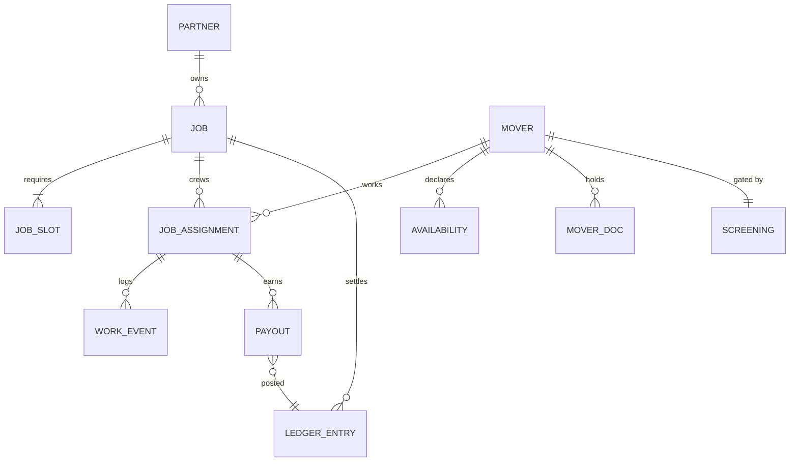

# 04 — Data Model

All money values are **integer cents (USC)** with `CHECK >= 0`. Timestamps are `timestamptz` stored in UTC. Data sits in Postgres + PostGIS.

## 1. ERD (core)



## 2. Tables

### partners
| col | type | notes |
|---|---|---|
| id | uuid pk | |
| name | text | SCS, Muvr, ... |
| type | enum | `scs` / `muvr` / `self_serve` |
| api_key_hash | text | stored hashed, never plaintext |
| webhook_secret | text | HMAC signing secret |
| rate_config | jsonb | per-partner pricing overrides |
| status | enum | active / suspended |
| created_at | timestamptz | |

### jobs
| col | type | notes |
|---|---|---|
| id | uuid pk | canonical id exposed to API |
| partner_id | fk partners | |
| partner_job_ref | text | dedupe key per partner |
| status | enum | RECEIVED VALIDATED MATCHING ASSIGNED STARTED COMPLETE CANCELLED SETTLED MISSED NO_COVERAGE |
| service_type | enum | load / unload / load_unload / pack / full |
| job_start_at / job_end_at | timestamptz | schedule window |
| pickup_zip / pickup_lat / pickup_lon | | inbound location |
| dest_zip / dest_lat / dest_lon | | outbound location |
| crew_size_hint | int | target crew count |
| hour_estimate | numeric | scheduled/hours |
| gross_amount_usd | bigint | total job value (USC) |
| partner_fee_rate | numeric | default 0.30 |
| status_history | jsonb | audit trail of transitions |
| created_at / updated_at | timestamptz | |

Indexes: `(status, job_start_at)`, `(partner_id, partner_job_ref)` unique, `(job_start_at)` BRIN.

### movers
| col | type | notes |
|---|---|---|
| id | uuid pk | |
| auth_id | text | identity provider subject |
| full_name / email / phone | | PII (graded) |
| stripe_connect_id | text | account for payouts |
| home_lat / home_lon | | home geo for radius |
| city / state / zip | | |
| status | enum | APPLICANT PENDING_SCREEN SCREENED BACKGROUND_PENDING ACTIVE SUSPENDED REJECTED |
| base_rate_usd_per_hr | numeric | capped |
| skills | text[] | mattress, piano, packing, dolly, ... |
| equipment_owned | text[] | dolly, straps, pads, ramps |
| w9_verified | bool | payout gate |
| rating_avg | numeric | customer + ops derived |
| reliability_score | numeric | from history |
| first_payout_release_ok | bool | hold on first 2 jobs |
| onboarded_at | timestamptz | |
| created_at | timestamptz | |

Indexes: `(status, home_lon, home_lat)` GiST for geo, `(city, state)`.

### job_slots
| col | type | notes |
|---|---|---|
| id | uuid pk | |
| job_id | fk jobs | |
| movers_required | int | e.g. 2 |
| hours | numeric | e.g. 3 |
| confirmed | bool | satisfied |

### job_assignments
| col | type | notes |
|---|---|---|
| id | uuid pk | |
| job_id | fk | |
| mover_id | fk | |
| role | enum | LEAD / MOVER / STANDBY |
| weight | numeric | LEAD=1.15, MOVER=1.0 |
| shift_actual_minutes | int | from check events |
| earnings_usd | bigint | computed at settle |
| status | enum | ASSIGNED CONFIRMED NO_SHOW CANCELLED_COMPLETED |
| assigned_at | timestamptz | |

Unique: `(job_id, mover_id)`. Idx: `(mover_id, status)`.

### work_events (timeline)
| col | type | notes |
|---|---|---|
| id | uuid pk | |
| assignment_id | fk | |
| type | enum | CHECK_IN CHECK_OUT PHOTO_INCIDENT SIGN_OFF |
| at | timestamptz | |
| lat / lon | | geotag |
| meta | jsonb | photo urls, notes |

### payouts
| col | type | notes |
|---|---|---|
| id | uuid pk | |
| assignment_id | fk | |
| mover_id | fk | |
| amount_usd | bigint | net after any adjustments |
| method | enum | ACH_STANDARD / INSTANT |
| stripe_payout_id | text | |
| status | enum | PENDING PAID FAILED CANCELED |
| idempotency_key | text unique | |
| created_at | timestamptz | |

### ledger_entries (double-entry)
| col | type | notes |
|---|---|---|
| id | uuid pk | |
| job_id | fk | |
| side | enum | DEBIT / CREDIT |
| account | enum | AR_RECEIVABLE PLATFORM_FEE CREW_PAYABLE MOVER_PAYABLE ESCROW CLAIM_RESERVE |
| amount_usd | bigint | signed |
| reference | text | payout_id / invoice id |
| posted_at | timestamptz | immutable |
| created_by | text | system / ops |

Index: `(account, posted_at)`. Enforce balanced per job via trigger or service.

### availability
| col | type | notes |
|---|---|---|
| id | uuid pk | |
| mover_id | fk | |
| weekday | int 0-6 | |
| start_local / end_local | time | |
| radius_km | int | default 40 |
| max_daily_hours | int | |
| max_jobs_day | int | |
| as_of | timestamptz | version for future edits |

Index: `(mover_id, weekday)`; query via effective window overlaps.

### screening (mirror of STRONG + our data)
| col | type | notes |
|---|---|---|
| id | uuid pk | |
| mover_id | fk | |
| strong_screening_id | text | external ref |
| strong_status | enum | PENDING PASS FAIL |
| strong_verdict_at | timestamptz | |
| checkr_candidate_id | text | |
| checkr_status | enum | clear / consider / suspend |
| checkr_report_url | text | restricted |
| notes | text | ops |
| mirrored_at | timestamptz | |

### mover_docs
| col | type | notes |
|---|---|---|
| id | uuid pk | |
| mover_id | fk | |
| kind | enum | W9 AGREEMENT ID_SELFIE |
| s3_key | text | |
| signed_at | timestamptz | |

## 3. State machines

### Mover
```
APPLICANT -> PENDING_SCREEN -> SCREENED -> BACKGROUND_PENDING -> ACTIVE
                \-> REJECTED (any screen fail)
ACTIVE -> SUSPENDED (policy/ops) <-> ACTIVE
```

### Job
```
RECEIVED -> VALIDATED -> MATCHING -> ASSIGNED -> STARTED -> COMPLETE -> SETTLED
  |-> VALIDATED -> NO_COVERAGE -> CANCELLED
  ASSIGNED -> NO_SHOW / MISSED
  completion can carry INCIDENT -> routed to claims (V2)
```

### Payout
```
PENDING -> PAID | FAILED (retry) | CANCELED
```

## 4. Constraints & invariants
- `sum(payout.amount + platform_fee + claim_reserve) == job.gross_amount_usd` per job (balanced).
- A mover cannot receive a payout while `w9_verified = false`.
- `job_assignments` unique per `(job_id, mover_id)`.
- Check-in events must be within configured geofence radius of the job location.
- Monetary columns always `>= 0`; signed direction carried by ledger side, never by negative amounts.
